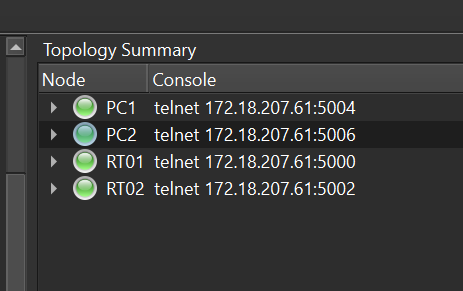
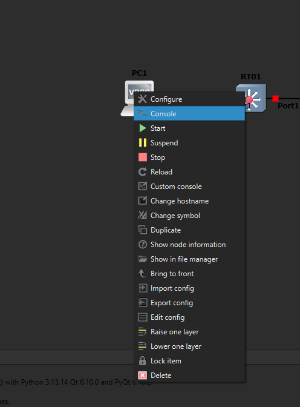

# Acessando as VPCs e os appliances Extreme no GNS3

Este tutorial mostra como abrir o console dos nós de uma topologia GNS3: as VPCs (hosts simulados) e os appliances Extreme (EXOS), estes últimos sem depender da interface do GNS3.

## Topologia de referência

O painel **Topology Summary** do GNS3 lista, para cada nó, o endereço de telnet do seu console (IP e porta):



Nesse exemplo:

- `PC1` : `telnet 172.18.207.61 5004`
- `PC2` : `telnet 172.18.207.61 5006`
- `RT01` : `telnet 172.18.207.61 5000`
- `RT02` : `telnet 172.18.207.61 5002`

O IP e as portas mudam de acordo com o servidor/projeto de cada um. Sempre confira o painel **Topology Summary** (ou clique com o botão direito no nó  **Console**) para pegar os valores corretos antes de seguir os passos abaixo.

## 1. Acessando as VPCs

O jeito mais simples é dar duplo clique no nó da VPC dentro do GNS3: isso abre automaticamente o console embutido (VPCS).



## 2. Acessando os appliances Extreme (RT01, RT02) via telnet

Para os equipamentos Extreme (EXOS), vamos conectar via telnet direto pelo terminal do sistema operacional, sem passar pela interface do GNS3. Use o IP e a porta do nó desejado (ver o painel **Topology Summary** acima).

### Linux

```
telnet 172.18.207.61 5000
```

### Windows

O cliente de telnet não vem habilitado por padrão. Para ativar:

- **PowerShell** (como administrador):

```
dism /online /Enable-Feature /FeatureName:TelnetClient
```

Depois, no `cmd`, entre no modo interativo do telnet e ajuste as opções antes de abrir a conexão:

```
telnet
Microsoft Telnet> unset crlf
Microsoft Telnet> set escape ^]
Microsoft Telnet> open 172.18.207.61 5000
```

Caso não utilize o crlf, você terá problemas ao entrar comandos

## 3. Primeiro login no Extreme (EXOS)

- **Usuário:** `admin`
- **Senha:** em branco (deixe vazio e pressione Enter)

No primeiro boot, o switch dispara um assistente de configuração de segurança, perguntando várias coisas em sequência (`[y/N/q]`):

```
Copyright (C) 1996-2024 Extreme Networks, Inc. All rights reserved.
This product is protected by one or more US patents listed at https://www.extremenetworks.com/company/legal/patents/ along with their foreign counterparts.
==============================================================================


Press the <tab> or '?' key at any time for completions.
Remember to save your configuration changes.

There has been 1 successful login since last reboot and 0 failed logins since last successful login.
No prior logins by this user since last reboot.


This switch currently has some management methods enabled for convenience reasons.
Please answer these questions about the security settings you would like to use.
You may quit and accept the default settings by entering 'q' at any time.

Multiple Spanning Tree Protocol (MSTP) is enabled by default to prevent
broadcast storms

Would you like to disable MSTP? [y/N/q]:

The switch offers an enhanced security mode. Would you like to read more,
and have the choice to enable this enhanced security mode? [y/N/q]:

Telnet is enabled by default. Telnet is unencrypted and has been the target of
security exploits in the past.

Would you like to disable Telnet? [y/N/q]:

SNMP access is disabled by default. SNMPv1/v2c uses no encryption, SNMPv3 can be
configured to eliminate this problem.

Would you like to enable SNMPv1/v2c? [y/N/q]:

Would you like to enable SNMPv3? [y/N/q]:

All ports are enabled by default. In some secure applications, it may be more
desirable for the ports to be turned off.

Would you like unconfigured ports to be turned off by default? [y/N/q]:

No failsafe account username and password are in effect.  If you choose to
configure them, please remember them because they cannot be recovered.
Would you like to configure the failsafe username and password now? [y/N/q]:

Since you have chosen less secure management methods, please remember to
increase the security of your network by taking the following actions:

  * change your admin password

* EXOS-VM.1 #
```

> **IMPORTANTE:** responda **não (`n`)** para todas as perguntas do assistente. Isso mantém as configurações padrão (MSTP habilitado, telnet habilitado, SNMP desabilitado, portas ligadas), que é o que vamos usar durante a disciplina.

Não é necessário a alteração da senha padrão
