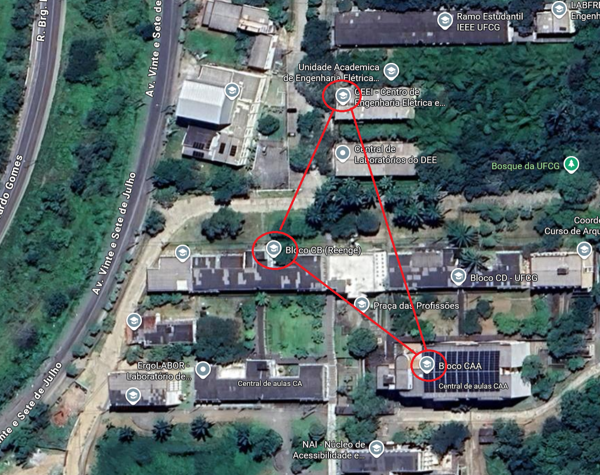

# Interligando os laboratórios do campus

A equipe de TI da UFCG está implantando a rede de quatro laboratórios distribuídos em dois blocos do campus, o REENGE e o CAA. A infraestrutura física já está pronta: os equipamentos estão instalados, cabeados e ligados ao núcleo de rede do CEEI.



A equipe já deixou configurado em cada roteador aquilo que depende da infraestrutura: as VLANs de cada laboratório, os endereços IP de cada interface e o encaminhamento entre interfaces. As máquinas de cada laboratório também já estão com IP e gateway definidos, configurados pelos guardians.

Falta uma coisa: as máquinas de um laboratório ainda não conseguem falar com as máquinas dos outros. 
<!-- Cada roteador conhece apenas as redes que estão diretamente ligadas a ele e não sabe como alcançar as demais. -->

**Sua tarefa é fazer as máquinas dos quatro laboratórios se comunicarem entre si.**

> ⚠️**Atenção.** Esta parte do laboratório deve ser feita sem o uso de LLM (ChatGPT, Claude, Gemini, Copilot ou similar). O objetivo é exercitar o raciocínio de roteamento, não a obtenção da resposta pronta. O uso de LLM nesta parte será considerado irregular.

## A topologia

O arquivo [ceei_net-full.gns3](https://drive.google.com/file/d/1Aa94lkMpuemJ6hFSGnAH43OiD8kOMiyP/view?usp=sharing) e [ceei_net-lite.gns3](https://drive.google.com/file/d/1h4_KhOA-a9h5POinMmPrbjbMZS9SbPt3/view?usp=sharing) tem implementada a topologia abaixo. 

> ⚠️**Atenção** : Baixe o arquivo e carregue no seu gns3


```
                          ┌─────────────────────────┐
                          │       RT-CEEI-03        │
                          │   (núcleo do CEEI)      │
                          │                         │
                          │  Porta 1: 10.20.0.2/30  │
                          │  Porta 2: 10.20.0.6/30  │
                          └───┬─────────────────┬───┘
                     Porta 1  │                 │  Porta 2
                              │                 │
               10.20.0.0/30   │                 │   10.20.0.4/30
                              │                 │
                    Porta 12  │                 │  Porta 12
        ┌─────────────────────┴───┐         ┌───┴─────────────────────┐
        │       RT-REE-01         │         │       RT-CAA-02         │
        │    (bloco REENGE)       │         │      (bloco CAA)        │
        │                         │         │                         │
        │ Porta 12: 10.20.0.1/30  │         │ Porta 12: 10.20.0.5/30  │
        │ Porta  1: 10.20.4.1/26  │         │ Porta  1: 10.20.5.1/27  │
        │ Porta  2: 10.20.4.65/26 │         │ Porta  2: 10.20.5.65/28 │
        └───┬─────────────────┬───┘         └───┬─────────────────┬───┘
   Porta 1  │                 │  Porta 2        │  Porta 1        │  Porta 2
            │                 │                 │                 │
     ┌──────┴──────┐   ┌──────┴──────┐   ┌──────┴──────┐   ┌──────┴──────┐
     │  PC-01-LCC  │   │PC-02-LABARC │   │ PC-03-LAEG  │   │  PC-04-MAT  │
     │ 10.20.4.2   │   │ 10.20.4.66  │   │ 10.20.5.2   │   │ 10.20.5.66  │
     └─────────────┘   └─────────────┘   └─────────────┘   └─────────────┘
         LCC                LABARC             LAEG          Materiais
```

## Endereçamento

### Bloco REENGE (roteador RT-REE-01)

| Laboratório | Rede | Gateway | Porta do switch | Máquina |
|---|---|---|---|---|
| LCC (Ciência da Computação) | 10.20.4.0/26 | 10.20.4.1 | 1 | PC-01-LCC: 10.20.4.2 |
| LABARC (Arquitetura de Computadores) | 10.20.4.64/26 | 10.20.4.65 | 2 | PC-02-LABARC: 10.20.4.66 |

### Bloco CAA (roteador RT-CAA-02)

| Laboratório | Rede | Gateway | Porta do switch | Máquina |
|---|---|---|---|---|
| LAEG (Apoio ao Estudante da Graduação) | 10.20.5.0/27 | 10.20.5.1 | 1 | PC-03-LAEG: 10.20.5.2 |
| Lab. de Materiais | 10.20.5.64/28 | 10.20.5.65 | 2 | PC-04-MAT: 10.20.5.66 |

### Enlaces com o núcleo do CEEI (roteador RT-CEEI-03)

| Enlace | Rede | Endereço no prédio | Endereço no CEEI |
|---|---|---|---|
| REENGE ao CEEI | 10.20.0.0/30 | RT-REE-01, porta 12: 10.20.0.1 | RT-CEEI-03, porta 1: 10.20.0.2 |
| CAA ao CEEI | 10.20.0.4/30 | RT-CAA-02, porta 12: 10.20.0.5 | RT-CEEI-03, porta 2: 10.20.0.6 |

O RT-CEEI-03 não tem laboratório ligado a ele. A função dele é concentrar o tráfego dos dois prédios.

## Etapa 1: reconhecendo o que já está configurado

Abra o console de cada roteador e faça login (usuário `admin`, sem senha). Se o equipamento perguntar sobre desabilitar Telnet, SNMP, portas não configuradas ou alterar a conta failsafe, responda `n` em todas.

Em cada roteador, execute:

```
show vlan
show iproute
```

O `show vlan` lista as VLANs configuradas e a porta associada a cada uma. O `show iproute` mostra a tabela de roteamento.

**Pergunta 1.** Quantas entradas aparecem no `show iproute` de cada roteador? De onde elas vieram, se ninguém configurou rota nenhuma ainda?

## Etapa 2: testes iniciais

### Teste A, dentro do mesmo prédio

No console de `PC-01-LCC`:

```
ping 10.20.4.66
```

### Teste B, entre roteadores

No console de `RT-REE-01`:

```
ping 10.20.0.2
```

No console de `RT-CAA-02`:

```
ping 10.20.0.6
```

### Teste C, entre prédios

No console de `PC-01-LCC`:

```
ping 10.20.5.2
```

**Pergunta 2.** O teste A funcionou? E o B? E o C? Explique por que alguns funcionaram e outros não, considerando o que cada roteador conhece neste momento.

**Pergunta 3.** No teste C, qual foi exatamente a mensagem de erro? Qual equipamento gerou essa mensagem? O que isso indica sobre onde o pacote parou?

## Etapa 3: planejando as rotas

Antes de digitar qualquer comando, responda no papel:

**Pergunta 4.** Para que o `ping` do teste C funcione (PC-01-LCC alcançando PC-03-LAEG), quais rotas precisam existir e em quais roteadores? Lembre que o pacote precisa ir **e voltar**: uma rota só resolve metade do caminho.

**Pergunta 5.** Para que **todas** as máquinas dos quatro laboratórios se comuniquem entre si, qual é o conjunto completo de rotas necessário em cada um dos três roteadores? Monte a lista antes de configurar.

Observe os blocos de endereços de cada prédio com atenção. Em alguns casos, duas redes de um mesmo prédio podem ser atendidas por uma única rota, em outros não. Vale conferir isso antes de sair digitando: uma tabela de roteamento menor é mais fácil de manter e de diagnosticar.

## Etapa 4: configurando

O comando para adicionar uma rota estática no EXOS é:

```
configure iproute add <rede>/<máscara> <próximo salto>
```

O `<próximo salto>` é o endereço IP do roteador vizinho que sabe alcançar aquele destino, e precisa ser um endereço que o roteador atual alcance diretamente.

Para remover uma rota:

```
configure iproute delete <rede>/<máscara> <próximo salto>
```

Configure as rotas que você planejou na Etapa 3. Depois de cada roteador, confira com `show iproute` e salve:

```
save configuration
```

## Etapa 5: validando

Repita os testes da Etapa 2 e acrescente os cruzamentos que faltam:

No console de `PC-01-LCC`:

```
ping 10.20.5.2
ping 10.20.5.66
```

No console de `PC-03-LAEG`:

```
ping 10.20.4.2
ping 10.20.4.66
```

Se algum falhar, use o `show iproute` dos três roteadores para descobrir qual rota está faltando, e em qual sentido do caminho.

## Etapa 6: quebrando de propósito

Agora que tudo funciona, vamos entender o papel do roteador do meio.

No console de `RT-CEEI-03`, remova **as duas rotas** que atendem os laboratórios LCC e LAEG (use `configure iproute delete`, e anote quais foram para poder recolocar depois).

Em seguida, no console de `PC-01-LCC`:

```
ping 10.20.5.2
```

**Pergunta 6.** O ping falhou? Note que as rotas de `RT-REE-01` e de `RT-CAA-02` continuam intactas: os dois prédios ainda sabem alcançar um ao outro. Por que, mesmo assim, a comunicação não funciona?

**Pergunta 7.** Recoloque apenas **uma** das duas rotas removidas e teste novamente. O que acontece? Por quê?

**Pergunta 8.** Recoloque a segunda rota e confirme que voltou a funcionar. Com base nos testes das perguntas 6 e 7, explique com suas palavras por que um ping precisa de rotas em ambos os sentidos do caminho.

Ao final, não esqueça de rodar `save configuration` em `RT-CEEI-03`.

## Entrega

Cada dupla deve chamar o professor para mostrar o cenário funcionando: os testes da Etapa 5 passando entre os quatro laboratórios, ao vivo, na tela.

```
show configuration
```


Além disso, entregue por escrito as respostas das perguntas 1 a 8.