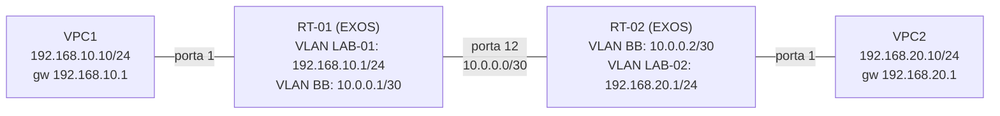

# Introdução

Este roteiro cobre a demonstração introdutória da disciplina e do simulador que vocês utilizaram até a chegada dos equipamentos. O intuito é demonstrar os comandos e a configuração de um equipamento de rede real (Extreme OS - EXOS), aplicando na prática os conceitos teóricos da disciplina de Redes de Computadores.

- [Cenário](#cenário)
- [Preparando o ambiente](#preparando-o-ambiente)
- [1. Configurando os hosts (VPCs)](#1-configurando-os-hosts-vpcs)
- [2. Configurando os roteadores](#2-configurando-os-roteadores)
  - [2.1. Configurando RT-02](#21-configurando-rt-02)
  - [2.2. Configurando RT-01](#22-configurando-rt-01)
- [3. Testes](#3-testes)
  - [3.1. Teste entre os roteadores](#31-teste-entre-os-roteadores)
  - [3.2. Teste nos hosts](#32-teste-nos-hosts)

## Cenário

Neste cenário apresentaremos a ligação de dois laboratórios da universidade.




Pensem no campus da universidade: cada bloco tem vários laboratórios, e cada laboratório é uma rede própria, com seus próprios computadores. Para os laboratórios conversarem entre blocos diferentes, é preciso um equipamento que fique na "porta" de cada laboratório e saiba entregar os pacotes para o bloco vizinho , esse é o papel do roteador (RT-01 e RT-02).

Nos equipamentos que utilizaremos na disciplina (Extreme - EXOS), cada rede que o roteador atende é representada por uma VLAN, e cada VLAN recebe um IP. Esse IP funciona como o endereço da porta daquele laboratório, e é ele que os computadores do laboratório usam como gateway (por isso o IP nunca é configurado na porta física, e sim na VLAN). Além da VLAN do próprio laboratório (`LAB-01` em RT-01, `LAB-02` em RT-02), cada roteador tem uma segunda VLAN, chamada `BB` (backbone), que é como um corredor extra ligando os dois roteadores entre si pela rede `10.0.0.0/30`.

Só configurar os IPs não é suficiente: por padrão o roteador não deixa um pacote passar de uma VLAN para a outra dentro dele mesmo , é preciso "destravar" essa passagem com `enable ipforwarding` em cada VLAN. E para o roteador saber por onde mandar um pacote destinado ao laboratório do outro lado, falta ainda uma rota estática, dizendo algo como "para chegar na rede do laboratório vizinho, mande pelo corredor `BB`, entregando ao roteador do outro lado".

Os nós RT-01 e RT-02 (EXOS VM) já estão no projeto GNS3, posicionados e conectados entre si pelo link `10.0.0.0/30`. Falta adicionar as duas VPCs e configurar tudo a partir do zero, ao vivo.

## Preparando o ambiente

Antes de continuar, é necessário instalar o GNS3 e ter a [imagem do Extreme OS instalada](../docs/install-gns3-exos.md).

> ⚠️ Para o primeiro acesso e uso básico do GNS3, dê uma olhada no [tutorial](../docs/tutorial-gns3-extreme.md).


## 1. Configurando os hosts (VPCs)

Como primeiro passo vamos configurar os hosts (`VPCs`), antes mesmo de mexer nos roteadores.

Abra o console de `VPC1` e configure o IP e o gateway:

```
ip 192.168.10.10/24 192.168.10.1
```

Depois de configurar, tente pingar o próprio gateway (RT-01) e o host do outro laboratório:

```
ping 192.168.10.1
ping 192.168.20.10
```

Abra o console de `VPC2` e faça o mesmo:

```
ip 192.168.20.10/24 192.168.20.1
```

Depois de configurar, tente pingar o próprio gateway (RT-02) e o host do outro laboratório:

```
ping 192.168.20.1
ping 192.168.10.10
```

O que aconteceu em cada um dos pings? Algum funcionou? Guardem essa observação , vamos entender o porquê ao longo das próximas seções, conforme os roteadores forem configurados.

PS: Aproveitem e explorem outros comandos disponíveis no console da VPC (`show ip`, `help`, etc).

## 2. Configurando os roteadores

Agora vamos configurar RT-02 e RT-01: criar as VLANs de cada laboratório e a VLAN de backbone, habilitar o roteamento entre elas e, por fim, adicionar as rotas estáticas que faltam para os dois lados se enxergarem.

### 2.1. Configurando RT-02

Abra o console de RT-02, faça login (`admin`, sem senha) e copie os comandos para configurar o roteador.

Criando a rede do `LAB-02`:

```
create vlan LAB-02 tag 10
configure vlan LAB-02 add port 1 untagged
configure vlan LAB-02 ipaddress 192.168.20.1/24
```

Criando a rede do backbone `BB`:

```
create vlan BB tag 20
configure vlan BB add port 12 untagged
configure vlan BB ipaddress 10.0.0.2/30
```

Pare aqui e rode `show vlan` para mostrar aos alunos as duas VLANs criadas, com a porta untagged associada a cada uma.

```
show vlan
```

Vamos ativar o encaminhamento de pacotes entre as VLANs. Esse é o ponto que costuma gerar dúvida: sem isso, mesmo com IP configurado, uma VLAN não passa tráfego para a outra.

```
enable ipforwarding vlan LAB-02
enable ipforwarding vlan BB
```

Vamos ver a tabela de roteamento:

```
show iproute
```

Ainda não é possível encaminhar o tráfego para o laboratório do outro lado!

<<colocar aqui um comando para expandir a explicação>>

Vamos criar a rota e ver o que acontece:

```
configure iproute add 192.168.10.0/24 10.0.0.1
```

### 2.2. Configurando RT-01

Em teoria o RT-01 já deve estar com essas configurações prontas, verifique com `show vlan` e `show iproute`. Caso não estejam, rode os comandos abaixo:

```
create vlan LAB-01 tag 10
configure vlan LAB-01 add port 1 untagged
configure vlan LAB-01 ipaddress 192.168.10.1/24

create vlan BB tag 20
configure vlan BB add port 12 untagged
configure vlan BB ipaddress 10.0.0.1/30
```

```
enable ipforwarding vlan LAB-01
enable ipforwarding vlan BB
```

Falta ainda adicionar a rota estática para a rede do outro lado:

```
configure iproute add 192.168.20.0/24 10.0.0.2
```

Confira com `show iproute`, destacando a entrada nova e o next-hop.

## 3. Testes

### 3.1. Teste entre os roteadores

Vale isolar o problema em duas partes: primeiro confirmar que RT-01 e RT-02 se enxergam, só depois trazer as VPCs para o teste.

Em RT-01:

```
ping 192.168.20.1
```

### 3.2. Teste nos hosts

Repita os pings do início do roteiro , agora ambos devem funcionar.

No console de `VPC1`:

```
ping 192.168.10.1
ping 192.168.20.10
```
